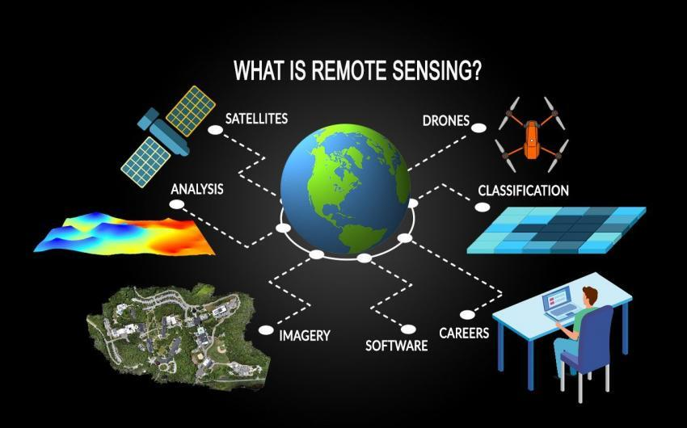
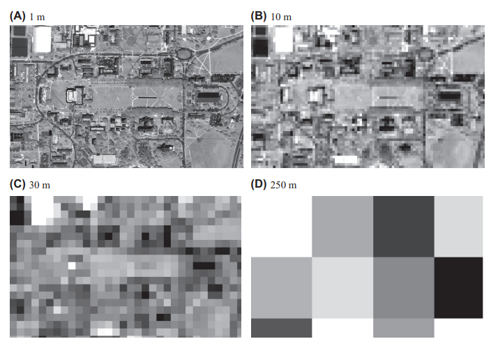
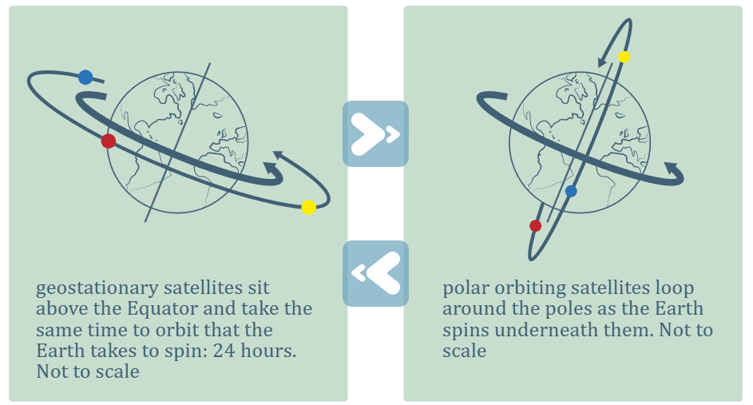
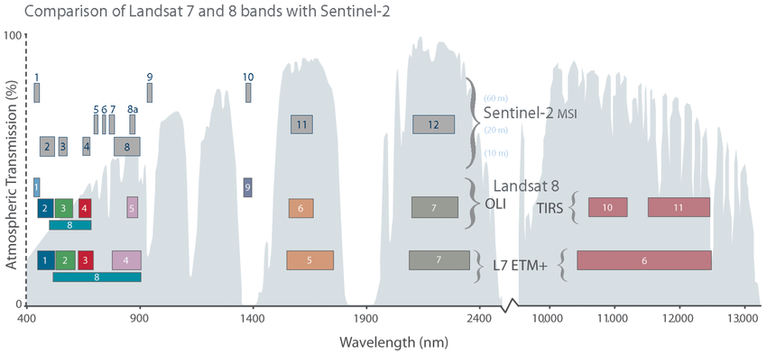
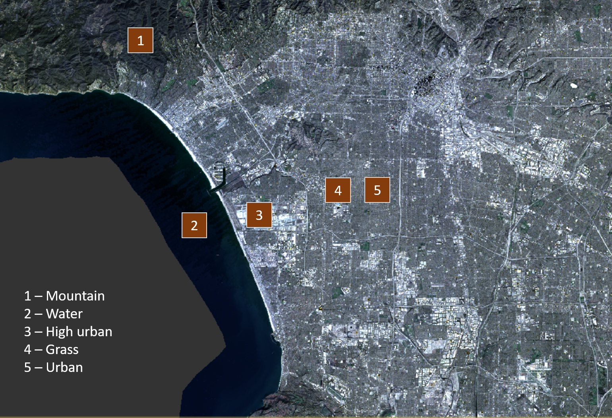
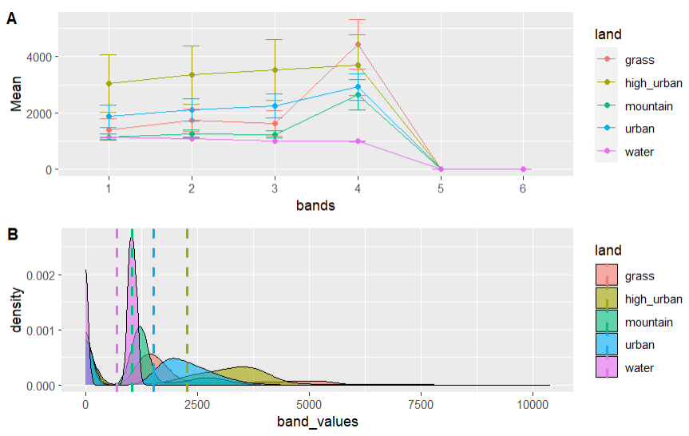
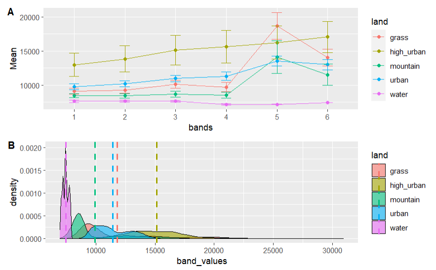
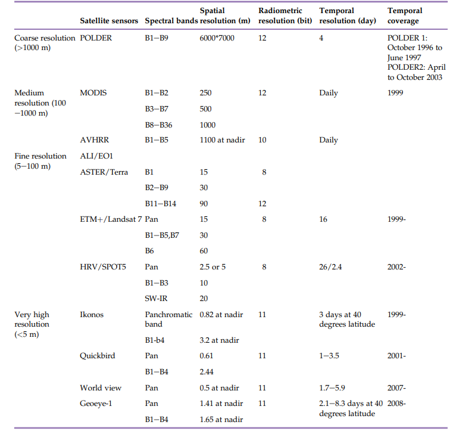

# Getting started with remote sensing

::: {.cell layout-align="center"}
::: {.cell-output-display}
{fig-align='center' width=100%}
:::
:::

***What is Remote Sensing?*** **Source: @gisgeography2023**

## Summary

In the first lesson of the course, we covered the basics of remote sensing. These include the definition of remote sensing, types of remote sensing, electromagnetic signatures and types of resolution. The summary section will mainly focus on the types of resolution.

### Definition of Remote Sensing

USGS: Remote Sensing is the process of detecting and monitoring the physical characteristics of an area by measuring its reflected and emitted radiation at a distance (typically from satellite or aircraft) [@usgs].

NASA: Remote sensing is acquiring of information from a distance. NASA observes Earth and other planetary bodies via remote sensors on satellites and aircraft that detect and record reflected or emitted energy [@nasa].

### Types of Resolution

1.  Spatial Resolution: the size of each pixel within a digital image and the area on Earth's surface represented by that pixel [@nasa]. A finer spatial resolution (or the smaller the number) means one is able to observe greater details while a coarser spatial resolution (or the bigger the number) means the image would be more pixelated as demonstrated below.

::: {.cell layout-align="center"}
::: {.cell-output-display}
{fig-align='center' width=100%}
:::
:::

***Campus of the University of Maryland at College Park at 1m, 10m, 30m and 250m spatial resolution.*** **Source: @liang2020**

2.  Temporal Resolution: frequency at which a satellite revisits the same observation area [@nasa]. Geostationary satellites orbit at the same rate of the earth and focus on the same observation area resulting in a higher temporal resolution. In contrast, polar orbiting satellites orbit around the entire Earth and able to observe the different parts of the world, at the cost of temporal resolution which could vary from 1 to 16 days.

::: {.cell layout-align="center"}
::: {.cell-output-display}
{fig-align='center' width=100%}
:::
:::

***Geostationary and Polar Orbiting Satellites.*** **Source: @instituteofphysics**

3.  Spectral Resolution: the number and width of spectral bands in a sensor system [@liang2020]. Sensors which have more bands with narrower wavelengths, have finer spectral resolution. This would allow greater distinction to be made between various features such as rock or vegetation types.

::: {.cell layout-align="center"}
::: {.cell-output-display}
{fig-align='center' width=100%}
:::
:::

***Comparison of spectral bands between Sentinel-2 and Landsat-8 which have similar characteristics for the coastal aerosol (440 nm), visible (490-800 nm) and short-wave infrared or SWIR (1300-2400 nm) spectral bands.*** **Source: @lopez-puigdollersBenchmarkingDeepLearning2021**

4.  Radiometric Resolution: amount of information in each pixel [@nasa]. Sensors with higher radiometric resolution are more sensitive and able to detect subtle differences in electromagnetic energy. This allows for features to be distinguished better such as variations in vegetation or water colour.

::: {.cell layout-align="center"}
::: {.cell-output-display}
{fig-align='center' width=100%}
:::
:::

***Campus of the University of Maryland at College Park at (A) 8 bits (2^8^ or 256 discrete shades of grey) , (B) 4 bits (2^4^ or 16 discrete shades of grey), (C) 2 bits (2^2^ or 4 discrete shades of grey) and (D) 1 bit (2^1^ or 2 discrete shades of grey) radiometric resolution.*** **Source: @liang2020**

## Application

### Practical Extracts

As part of our first practical for remote sensing, we had to select a city of our choice (Los Angeles) and source for Sentinel 2 and Landsat 8 images related to it. In SNAP, I selected various points of interest (urban, high urban, water, vegetation and mountains).

::: {.cell layout-align="center"}
::: {.cell-output-display}
{fig-align='center' width=100%}
:::
:::

***Landsat 8 image of Los Angeles with Points of Interest selected in SNAP.*** **Source: Author's Own.**

R was then used to plot the spectral profiles for both Sentinel 2 and Landsat 8. The results are as follow.

::: {.cell layout-align="center"}
::: {.cell-output-display}
{fig-align='center' width=100%}
:::
:::

***Spectral Profile generated from Sentinel 2.*** **Source: Author's Own.**

::: {.cell layout-align="center"}
::: {.cell-output-display}
{fig-align='center' width=100%}
:::
:::

***Spectral Profile generated from Landsat 8.*** **Source: Author's Own.**

### Sentinel 2 or Landsat 8. Which one should I use?

::: {.cell layout-align="center"}
::: {.cell-output-display}
{fig-align='center' width=100%}
:::
:::

***Comparison of Landsat 8 vs. Sentinel 2 bands.*** **Source: @ahadyClassificationComparisonLandsat82022**

Sentinel 2 performs better than Landsat 8 as it has better spatial resolution as seen from the pixel size column in the table above [@ahadyClassificationComparisonLandsat82022]. It also has a better temporal resolution of ten days at the equator using one satellite, and five days using two satellites, under the assumption of cloud-free conditions [@sentinelonline]. In contrast, Landsat 8 has a temporal resolution of 16 days [@castaldiSentinel2Landsat8MultiTemporal2021].

A study of both satellites in forest variable prediction shows that Sentinel 2 performed better than Landsat 8 in predictive accuracy, due to the former's higher spatial resolution and additional red-edge bands [@astolaComparisonSentinel2Landsat2019]. Sentinel 2 has four narrow bands in the red edge spectral domain which allows it to accurately study vegetation health or crop stress monitoring [@segarraRemoteSensingPrecision2020].

Where Landsat 8 performs better is that it has thermal infrared sensors to measure surface temperature, a feature that Sentinel 2 does not possess [@usgs]. This makes Landsat 8 suitable for studying processes such as the hydrologic cycle and climate change [@liEvaluationLandsat8like2021]. Landsat 8's capabilities to measure land surface temperature also enables it to identify areas where the urban heat island effect is strongest in cities [@orusaLandsatThermalData2019].

Overall, Sentinel-2 would be useful for looking at Land Use Land Cover (LULC) and vegetation related studies while Landsat 8 would be useful for studies related to urban heat island and climate change.

## Reflection

Why can’t we develop a satellite that boast the best spatial, temporal, spectral and radiometric resolution, while also incorporating sensors for diverse measurements such as temperature? The limitations stem from inherent trade-offs related to the sensor designs. For example, better quality spatial and multispectral data on satellites would compete for onboard data storage space, as well as data transmission requirements to communicate with ground stations [@ciesin1993]. To improve the signal-to-noise ratio, solutions such as having a larger pixel size or accepting light from a wider spectral interval can be used, but will result in a decrease in spatial and spectral resolution respectively [@jiaTradeoffsSpatialSpectral2022].

Given that no perfect satellite exists currently, it ultimately depends on one’s research needs and what to prioritise. MODIS which has 36 bands, can be used to study dust clouds because its bands 29-32 are able to track dust aerosols and it has a temporal resolution of one day [@boroughaniPredictingDustStorm2021]. However, it has medium spatial resolution at 250m, 500m and 1000m depending on the band. . On the other hand, a study of land use changes over time probably does not require daily satellite images but perhaps at a monthly interval. However, higher spatial resolution to distinguish finer details to observe changes in the pattern would be essential. A table of some commonly used satellite sensors as below compiled shows some of the tradeoffs between the various resolutions.

::: {.cell layout-align="center"}
::: {.cell-output-display}
{fig-align='center' width=100%}
:::
:::

***Overview of some commonly used satellite sensors.*** **Source: @liang2020**

Another thing that struck me is how big the remote sensing data is. Processing and saving in SNAP, followed by running the spectral signatures in R took quite a fair bit of waiting time as a result. I had flashbacks to my undergraduate days waiting in the lab for some remote sensing results to process on ENVI and ArcGIS. Hence, the Google Earth Engine segment would be something to look forward to given it runs on cloud computing resources and will be able to handle geospatial data compared to my personal device. I was also reminded of the recent AGI GeoCom 2023 on the ‘Environmental Impacts of Earth Observation in the Constellation and Cloud Computing Era’ presentation [@wilkinsonEnvironmentalImpactsEarth2024]. The central idea was that considering the substantial file size of remote sensing data and the fact that not all data is essential, it may be worthwhile to reassess the necessity of storing all available datasets. This is especially so due to the environmental implications associated with the storage of large datasets in data centers.

