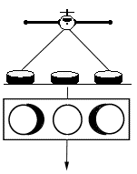
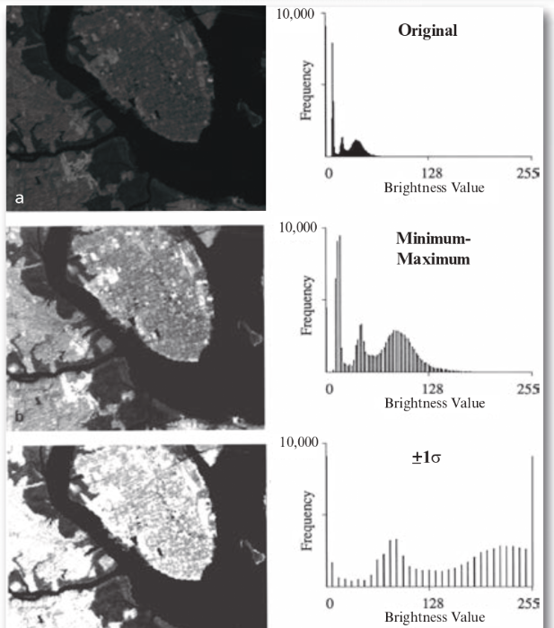
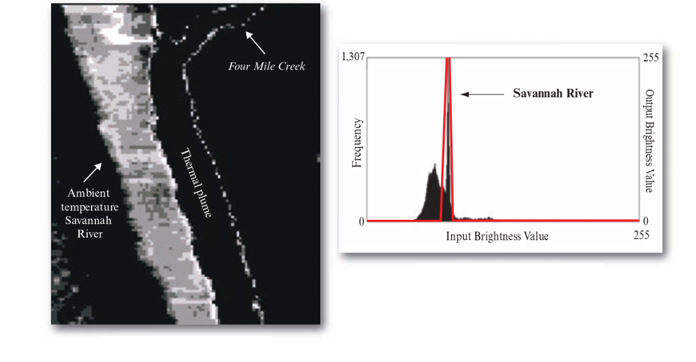
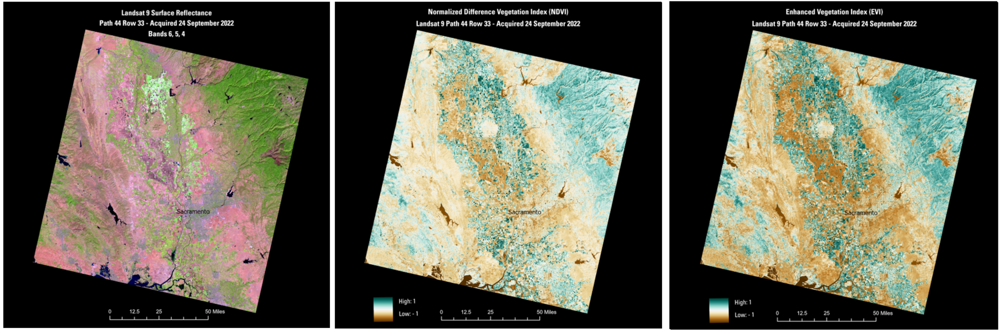

# Remote Sensing Data

The tl;dr of this week’s session is that remote sensing images could have issues arising from the sensor, atmosphere or other noise. This requires some correction to be undertaken although most images come processed and ready for analysis nowadays. Overall, geometric correction, atmospheric correction, orthorectification correction and radiometric calibration were covered. Furthermore, joining datasets and image enhancements were discussed. Image enhancement can improve the appearance of an image for visual inspections or for subsequent analysis. Techniques include contrast enhancement, band ratioing, principal component analysis (PCA), etc. The summary below will focus on discussing geometric correction and contrast enhancement.

## Summary

### Geometric Correction

Distortions in images could arise from a variety of sources and the implications are that the image is not representative of what is on the ground. In images, shape remain accurate directly below the sensor (nadir) but distortion occurs towards the edges of the image [@toutin2011]. The distance from the sensor to the ground is further at the edges than at the nadir resulting in a greater compression of the features.

::: {.cell layout-align="center"}
::: {.cell-output-display}
{fig-align='center' width=30%}
:::
:::

***Shape preservation at the nadir and distortion towards the edges.*** **Source: [@governmentofcanada2015].**

Other causes of distortion could include inconsistency in the altitude and velocity of the sensors [@pennstatecollegeofearthandmineralscience]. As the Earth rotates on its axis and satellites orbit around the Earth, this results in the image being skewed. This is due to each scan row covering an area slightly west of the preceding image.

To correct this issue, Ground Control Points (GCPs) need to be identified to match known points (e.g. prominent landmarks, buildings, intersections) in the image with a reference dataset which could be in the form of a local map or another image.

::: {.cell layout-align="center"}
::: {.cell-output-display}
{fig-align='center' width=90%}
:::
:::

***Creating ground control points to match uncorrected image to reference image prior to applying polynomial transformation.*** **Source: [@basith2011].**

A geometric transformation is then applied to each pixel for rectification purpose. There are two modelling methods: 1) input to output (forward) mapping and 2) output to input (inverse) mapping [@jensen2015]. In the former, pixels in the original image are transformed to have new coordinates in the reference image based on a formula created from the GCPs. However, a possible issue may arise when the transformed coordinates do not correspond with integer coordinates in the reference image and hence may have missing values. The latter of output to input (backward mapping) is able to overcome this issue. This process takes a value in the reference image, inputs it into the equation and returns a value in the original image, thus ensuring that there is a new value in the latter. As a check if the pixels between the original and reference image are aligned, the root mean squared error (RMSE) can provide an indication of the best fit. A lower RMSE is preferred with some studies suggesting a threshold of 0.5 or less [@jensen2015]. Lower RMSE can be achieved by adding more ground control points. Lastly, there may be some misalignment between the original grid and new grid in the transformation process and hence there is a need for resampling of interpolating new pixel values based on the original pixel values. Resampling techniques include nearest neighbour, linear, cubic and cubic spline.

### Contrast Enhancement

Different surfaces (e.g. soil, vegetation, urban) reflect comparable amount of energy in the visible, near-infrared and middle-infrared portions of the electromagnetic spectrum [@jensen2015]. As such, it remains challenging to visually distinguish between various materials. The reason for this low contrast is due to images using only brightness values between 4 and 104, thereby neglecting brightness values in the ranges of 0 and 3, and 106 and 255. Various methods to expand the range and utilise these values to increase the contrast include 1) minimum-maximum, 2) percentage linear and standard deviation and 3) piecewise linear contrast stretch.

Minimum-maximum method is usually applied to remote sensing images where the distribution of the pixel values assume a normal or near normal distribution. Any pixel with a brightness value of 4 would be assigned a bright value of 0 now while any pixel with a brightness value of 105 would be given a brightness value of 255. In other words, the brightness values are now linearly distributed between 0 and 255 instead of 5 and 104 thus increasing the contrast.

Percentage linear and standard deviation is similar to the minimum-maximum method where a certain percentage or standard deviation of pixels from the mean are used instead. The brightness value within these specified minimum and maximum values are now linearly distributed between 0 and 255 instead. Brightness values below the lower and above the upper bound of the percentage or standard deviation, are mapped to the minimum and maximum of the dynamic range. As such, there are more black and white pixels thus creating a larger contrast [@al-amri2010].

::: {.cell layout-align="center"}
::: {.cell-output-display}
{fig-align='center' width=100%}
:::
:::

***From top to bottom row: Original Landsat Image of Charleston, South Carolina and corresponding histogram; Minimum-maximum contrast stretch applied to image and corresponding histogram; Standard deviation contrast stretch and corresponding histogram.*** **Source: [@jensen2015].**

Piecewise linear contrast is used when the pixels do not assume a normal distribution such as assuming a bimodal or trimodal pattern. In this case, the analyst identifies breaks in the histogram of brightness values and applies different transformations to stretch the values. Piecewise linear contrast is used to exaggerate or highlight specific features in the images such as a river while making the surrounding land appear black.

::: {.cell layout-align="center"}
::: {.cell-output-display}
{fig-align='center' width=100%}
:::
:::

***Piecewise linear contrast stretch used to exaggerate Savannah River and corresponding histogram.*** **Source:** [@jensen2015]**.**

## Application

In this week’s practical, the focus was on image enhancements such as band ratioing, filter, texture, data fusion, and Principal Component Analysis (PCA). In band ratioing, the contrast between features are enhanced by “dividing the brightness values (digital numbers) at peaks/maxima and troughs/minima in a reflectance curve after the additive atmospheric haze and additive sensor offset have been removed” [@ghrefat2023]. One common example of band ratioing is the Normalised Difference Vegetation Index (NDVI) used to examine vegetation density and health [@usgsa]. NDVI is calculated by taking the ratio between the red (R) and near infrared (NIR) values and can be represented by the equation:

NDVI = $\frac{NIR - Red}{NIR+Red}$

::: {.cell layout-align="center"}
::: {.cell-output-display}
{fig-align='center' width=100%}
:::
:::

***From left to right: all NDVI values for Cape Town, South Africa; NDVI values above 0.20 for Cape Town, South Africa.*** **Source: Author's Own.**

Numerous studies have used NDVI to study vegetation which includes the use of NDVI to monitor vegetation dynamics for Africa between 1982 and 1983 [@tucker1985]. The study examined how phenomenon such as the movement of the Intertropical Convergence Zone or the 1983 drought in the Sahel influenced vegetation density and productivity given these changes in rainfall.

However, a limitation of NDVI is the saturation effect for densely vegetated surfaces such as forested grounds [@jiang2007]. Other indices such as Enhanced Vegetation Index (EVI) are suggested to overcome this drawback and reduce background noise and atmospheric interference. Overall, this means that the signals observed is primarily due to vegetation, making it more accurate to visually assess plant health.

::: {.cell layout-align="center"}
::: {.cell-output-display}
{fig-align='center' width=100%}
:::
:::

***From left to right: Landsat Surface Reflectance; NDVI derived image: EVI derived image.*** **Source:** [@usgsa**; @usgsb**]

## Reflection

This week’s lecture was content heavy with the different types of factors that can influence the quality of images, methods of corrections, along with image enhancement techniques. Even though many images come pre-processed nowadays, the lecture was still useful in gaining an appreciation for the processes involved before an image is ready for analysis. In the broader scheme, it is important to question and understand the assumptions underlying data processing, as biasness could be introduced.

Furthermore, there could be cases where the images are not ready for analysis and require some additional processing. This is quite likely given that I sometimes use my drone for photography and I am hoping to explore what kind of analysis I can do with the images in the future.

::: {.cell layout-align="center"}
::: {.cell-output-display}
{fig-align='center' width=100%}
:::
:::

***Pulau Besar in Malaysia taken from Dji Mini 2.*** **Source: Author's Own.**

